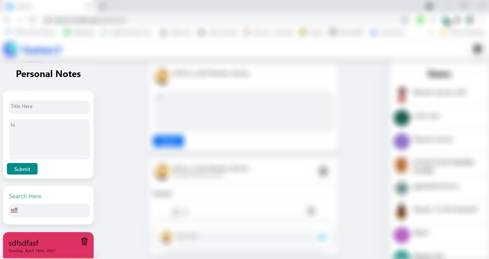

# Welcome To Kannect (Kalika (कलिका )+Connect)

* It is a Social Media for Budding Future Generation who wants to Learn Something while surfing freely on Internet

 * For Now (New features will be added in future) It has Login/Logout Feature, Create Notes for Personal, Share Your Knowledge with Other People,Comment and Like, Chat with Friends etc.

 ---
 #  [Kannect]('https://kannect.netlify.app/') Features 

 1. LOGIN
 
> User Can Login with Google Account

* Loading Button Feature
    
> Loading Button shows Fetching Process

---

2. Full Page Content

---

3. Post Feedback
>Your Can Like and Comment on any Post and also you can delete Your own comment if you don't like it

---

4. Personal Short Notes
>It contains Your Personal Notes, You can Create and Delete and Search Your Notes Here

---

5. Notes Search
> You can search Your Notes here by just entering text and it will filter automatically your Notes. eg; filter all Notes which contains Data

---

6. Users List

---

7. Chatting
> You Can also Chat with your Friends 

---

### Not only this New updates will come in Future with great Features. 
>Also Some bugs may be there report it so that i can fix them.

[Link to Website]('https://kannect.netlify.app/')  

`Hope You Liked It` 

# Technologies Used
* HTML
* SASS
* JavaScript
* ReactJs
* Redux
* webpack
* babel
* Firebase (Database and Authentication)
* Express 
* Nodejs
---

* Netlify For Deployment
* Yarn as Package Manager